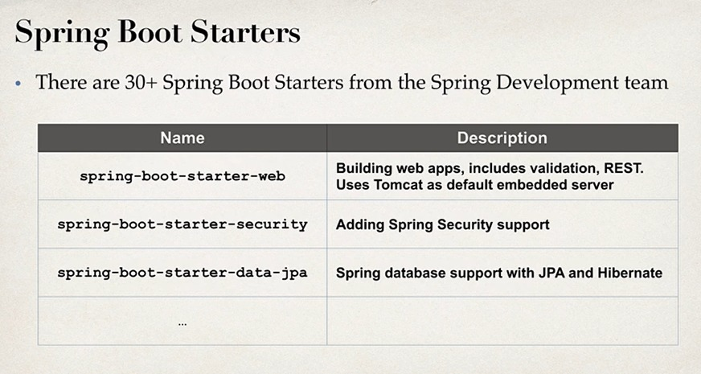
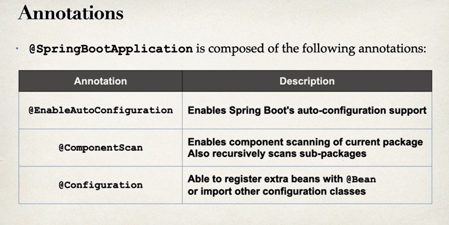

# REST Controller
  - @RestController can be used to create controller
  - we can use GetMapping or PostMapping to handle http requests

# Maven
  - Maven is a project management tool
  - most popular use of maven is for build management and dependecies

## problems solved by Maven
  - when building java project we may need additional JAR files like Spring, Hibernate, JSON etc.
  - one approach is to downoad JAR files from each project web site
  - manualy add JAR files to our build path/classpath
  - We tell maven the dependencies we are working on.
  - maven will go and download the JAR files of these project and will make those available during compile/run

## How maven works
  - we have config file in the project which maven reads
  - check maven local repo if the dependencies are present if not there will pull it from mavem central repo (remote)
  - maven will also download supporting dependicies

# pom.xl
  - Project Object Model file(pom file)
  - configuration file of project
  - maven uses this to get the dependicies in project
  - located in root

## POM file structure
  1. Project Meta Date --> project name, version etc. Output File type: JAR, WAR
  2. Dependicies --> list of dependicies
  3. Plug ins --> Additional custom tasks to run: generate JUnit test reports etc

# Spring Boot
  - provides makes it easier to get started with spring dev
  - minimize amount of manual config
  - help to resolve dependency conflicts
  - provide an embedded http server
  - spring boot apps can run stand alone 

## Create a spring project
  - spring initializer can be used to create a spring project
  - [https://start.spring.io/](https://start.spring.io/) we can select the spring version, language, language and dependencies
  - `Artifact` in metadata is the name of the project 
  - in dependencies, you can add all the dependencies required

# Adding Rest Controller
  - We added a new package rest and in that we are writing the controller
  - `@RestController` will define the rest controller
  - `@GetMapping` will listen to the get request and call the function below

# File Structure
  - `src/main/java` --> java source code
  - `src/main/resources` --> properties/config files used by app
  - `src/main/webapp` --> jsp file and other web assets(css, js) etc
  - `src/test` --> unit test
  - `target` --> destination directory for compiled code will be created by maven automatically
  - `mvnw` allows you to run a maven project. It is a maven wrapper file. it'll automatically download maven and run
  - `mvnw clean compile test` in windows

# Plugin
  - spring-boot plugin is used to run the maven project
    - `./mvnw package`
    - `./mvnw spring-boot:run` or `mvn spring-boot:run`

# Application properties
  - all propoerties for spring are pick up from this file
  - file path is `src/main/resources/application.properties`
  - it will be created by spring initializer
  - it is empty at beginning
  - we can change port number for example
  - we can also add custom properties

# Spring Boot Starters
  - A curated list of Maven Dependencies
  - A collection of dependencies grouped together
  - reduces amount of maven configuration 
  - 

# Spring Boot dev tools
  - `spring-boot-devtools` automatically restart application when code is updated
  - add dependency it to POM
  - if intellij is used select build project automatically in build/compile and in advanced settings select the auto make

# Spring Boot Actuator
  - Exposes endpoints to monitor and manage your application
  - Add dependency to POM file
  - `spring-boot-starter-actuator` add in POM
  - REST endpoints are automatically added to application
  - no need to write additional code
  - Endpoints are prefixed with: `/actuator`
  - these are provided for free
## Health Endpoint
  - `/health` checks the status of app.
  - can be used by monitoring apps to see if app is up or down
  - health status is customizable
## Info endpoint
  - `info` is not exposed only `health` is exposed
  - to expose `info` change it in `application.properties`
  - Properties starting with `info` will be used by `/info`
  - `management.endpoints.web.exposure.include=health,info` add this in `application/endpoints`
  - `management.info.env.enabled=true`
## Additional endpoints
  - `/auditevents` audit events for your app
  - `/beans` list of all beans registered in spring app context
  - `/mappings` list of all `@RequestMapping` paths
  - `/threaddump` will give info of all thread running in app

# Spring Security
  - We do not want to expose all the information
  - Add spring security and endpoints are secured
  - sign in prompt is generated for login to access the endpoints password is generated in console and username is `user`
  - `spring.security.user.name=lokesh`
  - `spring.security.user.password=naik` we can add these in the POM to overwrite 
  - `management.endpoints.web.exposure.exclude=health` to exclude endpoints when we try to acc this we get 404 whitelabel error page

# Spring Application running commands
  1. `mvn package` jar file is created
  2. `java -jar <jar_file_path` no need to run tomcat as, unlike maven spring boot already has tom cat running
  3. `mvn spring-boot:run` can also be used

# @Value annotation
  - `@Value` is sued to inject values into the spring boot app defined in `application.properties`
  - `import org.springframework.beans.factory.annotation.Value;` add this to the value where we want to import the value

# Core Spring 

# Inversion Of Control (IOC)
  - Approach of outsourcing the construction and management of objects

# Spring Dependency Injection
  - Dependency Inversion Principle
  - Client delegates to another object the responsibility of providing its dependencies
## Injection Types
  - There are two recommended types of injection
    - Constructor Injection
    - Setter Injection
### Constructor Injection
  - Use this when you have required dependencies
  - Generally recommended by spring.io dev team as first choice
### Setter Injection
  - User this when you have optional dependencies
  - If dependency is not provided, your app can provide reasonable default logic

## Spring AutoWiring
  - For dependency injection, Spring can use autowriting
  - Spring will look for a class that matches
  - Spring will inject it automatically hence autowired

# @Component
  - `@Component` annotation marks the class as a Spring Bean and makes it a candidate for dependency injection
  - A spring bean is regular java class that is managed by Spring
# @Autowired
  - `@Autowired` annotation tells spring to inject a dependency
  - If you have one constructor then `@Autowired` on constructor is optional

# Component Scanning
  - Spring will scan java classes for special annotations and register the beans in the spring container automatically
  - 
  - Spring boot will only scan for main class and the package in which the main class is present
  - Scanning only works for `com.lokeshSpring.lokeshSpringCourse` but doesn't work for `com.lokeshSpring.util` or anyother
  - To scan all these we need to explicitly list the base packages to scan check in springApplication main file

# Setter Injection
  - Inject dependencies by calling setter method on your class
  - Steps
    - Create Setter method in your class for injects
    - Configure dependency injection with `@Autowired` Annotation
  - Inject dependencies by calling any methods on your class just use `@Autowired` for the function

# Field Injection
  - It is not being used now
  - can be seen in legacy projects
  - it makes code harder to unit test
  - Inject dependencies by setting Field values on your class directly (even private fields)
  - Accomplished by `Java Reflection`

# `@Qualifier`
  - `@Qualifier` specify the bean id with name as class but first character lower-case
  - in arguments, we pass the bean id as `Qualifier`

# `@Primary`
  - If there are multiple beans we set one of the bean as primary in the constructor
  - It is added right after `@Component` this way we don't need to use `@Quaifier`.
  - We can't use more than one primary bean. So only one bean is used as primary
  - `@Qualifier` has highest priority. Even though we mention `@Primary`.

# Lazy Initialization
  - Instead of creating all beans up front, we specify lazy initialization
  - A bean will only be initialized when it is needed for dependency injection or explicitly requested
  - `@Lazy` annotation is used
  - `spring.main.lazy-initialization=true` all beans are set as lazy and only created when needed
  - once `dailyworkout` endpoint is invoked spring will determine dependencies for demoController
  - This feature is disabled by default
## Disadvantages of Lazy
  - for web related components like `@RestController` beans aren't created until requested
  - Many not discover config issues until too late
  - Need to make sure enough memory is present when beans are created
